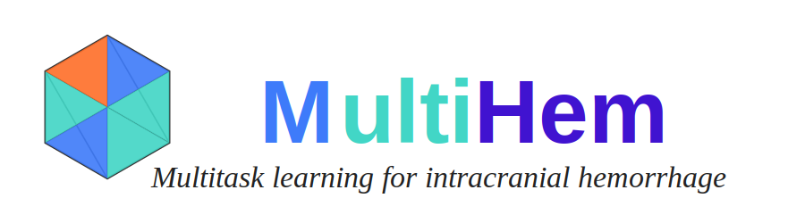

<div align="center">
  
  
  [](https://github.com/mikami520/MultiHem/stargazers) [](https://github.com/mikami520/MultiHem/commits/main) [](https://www.python.org/downloads/release/python-3100/) [](https://opensource.org/licenses/MIT) [](https://pytorch.org/)
</div>

## 📑 Overview

**MultiHem** is a multitask learning framework for simultaneous segmentation and classification of intracranial hemorrhage using CT scans. This project implements state-of-the-art deep learning techniques to improve diagnostic accuracy for various types of brain hemorrhages.

> [!WARNING]
> This code is proprietary and should not be used for other projects without explicit permission from the authors.

## 🚀 Quick Start

### Clone the Repository

```bash
git clone https://github.com/mikami520/MultiHem.git
cd MultiHem
```

### Installation

```bash
# Create and activate conda environment
conda create -n hem python=3.10
conda activate hem

# Install with all dependencies
pip install -e '.[all]'
```

## 🛠️ Dependencies

<details open>
<summary><b>Core Dependencies (installed via <code>pip install -e .</code>)</b></summary>

- torch
- omegaconf
- tqdm
- scipy
- monai
- tensorboard
- matplotlib

</details>

<details>
<summary><b>Full Dependency List (installed via <code>pip install -e '.[all]'</code>)</b></summary>

### Image Processing
- nibabel
- skimage
- pillow
- itk
- cucim
- openslide
- tifffile
- imagecodecs
- pydicom
- pynrrd

### Deep Learning
- torchvision
- torchaudio
- transformers
- huggingface_hub
- onnx
- onnxruntime

### Experiment Tracking
- tensorboard
- tensorboardX
- mlflow
- clearml

### Data Handling
- pandas
- h5py
- zarr
- lmdb

### Utilities
- einops
- psutil
- pynvml
- fire
- jsonschema
- ninja
- pyyaml

### Optimization
- ignite
- nni
- optuna
- lpips

</details>

<details>
<summary><b>Development Dependencies (installed via <code>pip install -e '.[dev]'</code>)</b></summary>

- pytest
- black
- flake8
- isort
- mypy

</details>

## 📊 Data Processing

Preprocessing and data augmentation pipelines are implemented through the `monai.transform` module. Detailed transformation configurations can be found in `trainer.py`.

## 🧠 Training

Configure your experiment by modifying `config.yml` to specify:
- Dataset paths
- Network architecture
- Hyperparameters
- Training settings

```bash
python main.py --cfg config.yml --device cuda
```

Training artifacts (loss plots, saved models, checkpoints, log files) are saved in the `exp` folder.

## 🔍 Inference

To run inference on test data:

```bash
python main.py --cfg config.yml --device cuda --test
```

All prediction results are saved in the `prediction` folder.

## Star History

<p align="center">
  <a href="https://www.star-history.com/#mikami520/MultiHem&Date">
   <picture>
     <source media="(prefers-color-scheme: dark)" srcset="https://api.star-history.com/svg?repos=mikami520/MultiHem&type=Date&theme=dark" />
     <source media="(prefers-color-scheme: light)" srcset="https://api.star-history.com/svg?repos=mikami520/MultiHem&type=Date" />
     
   </picture>
  </a>
</p>


<div align="center">
<p>Developed by Chris Xiao | University of Toronto</p>
<p>© 2025 All Rights Reserved</p>
</div>
